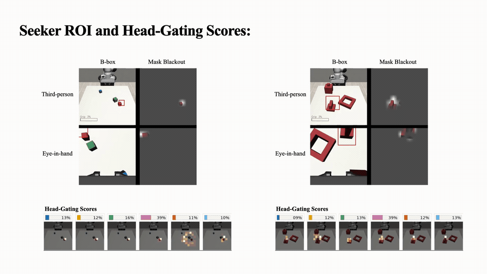
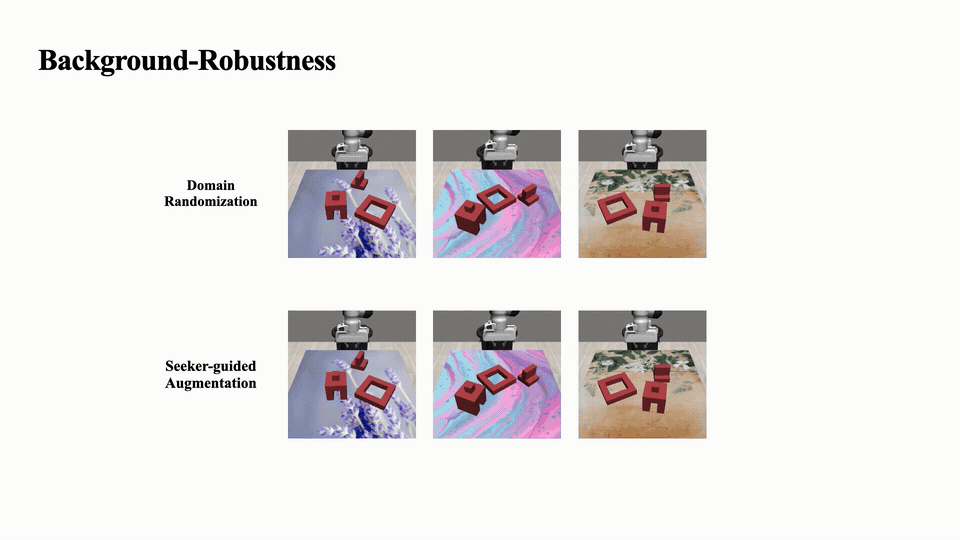

# Seeker

Seeker is a visuomotor learning framework for learning task-relevant visual bottlenecks directly from action supervision. It predicts soft attention masks and spatial regions from observations, then conditions policy inputs on those regions for more robust and sample-efficient policy learning. [More Demos](./multimedia/)

<table width="100%">
<tr>
<td width="50%" align="center"></td>
<td width="50%" align="center"></td>
</tr>
<tr>
<td align="center"><sub>Third-person and eye-in-hand ROI with per-view multi-head coordination scores, produced solely from action supervision.</sub></td>
<td align="center"><sub>Seeker-guided augmentation vs. domain randomization under background shift.</sub></td>
</tr>
</table>

## Paper

__[Attention from Action, for Action: Emergent Visual Bottlenecks for Policy Learning](./multimedia/paper.pdf)__

Zheyu Zhuang¹ · Ruiyu Wang¹ · Nick Heppert² · Johannes Fabian Hahn³ · Abhinav Valada² · Florian T. Pokorny¹ · Danica Kragic¹

_¹KTH Royal Institute of Technology &nbsp;&nbsp;²University of Freiburg &nbsp;&nbsp;³Universität Hamburg_

## Citation

```bibtex
@article{zhuang2026seeker,
  title   = {Attention from Action, for Action: Emergent Visual Bottlenecks for Policy Learning},
  author  = {Zhuang, Zheyu and Wang, Ruiyu and Heppert, Nick and Hahn, Johannes Fabian and Valada, Abhinav and Pokorny, Florian T. and Kragic, Danica},
  year    = {2026},
  eprint  = {2608.13422},
  archivePrefix = {arXiv},
  url     = {https://arxiv.org/abs/2608.13422},
  note    = {CoRL 2026}
}
```

## Installation

### 1. Clone

```bash
git clone https://github.com/zheyu-zhuang/seeker.git
cd seeker
```

### 2. Create the environment

```bash
mamba env create -f conda_environment.yaml
conda activate seeker
```

### 3. Install system dependencies

#### Option A: system packages via `sudo` (preferred)

```bash
sudo apt install -y libosmesa6-dev libgl1-mesa-glx libglfw3 patchelf
```

#### Option B: Conda fallback (if `sudo` unavailable)

```bash
mamba install -c conda-forge glew mesalib
mamba install -c menpo glfw3
```

### 4. Set up suite dependencies and assets

```bash
seeker setup
```

This installs the pinned `robosuite`/`robomimic`/`mimicgen` suite, downloads the required assets and checkpoints into `.weights/`, and builds `.weights/task_emb_cache.npz`.

See [`seeker/model/WEIGHTS.md`](./seeker/model/WEIGHTS.md) for checkpoint provenance, checksums, and the training recipe for `seeker.mimicgen.pth`.

## Quickstart

The fastest way to inspect Seeker requires no training: rerender one MimicGen task, then visualize predictions from the released checkpoint.

```bash
TASK=three_piece_assembly_d2

mkdir -p datasets/mimicgen/${TASK}
wget -O "datasets/mimicgen/${TASK}/${TASK}.hdf5" \
  "https://huggingface.co/datasets/amandlek/mimicgen_datasets/resolve/main/core/${TASK}.hdf5?download=true"

seeker rerender-dataset \
  --dataset datasets/mimicgen/${TASK}/${TASK}.hdf5 \
  --n-demo 100 \
  --num-workers 4
```

Then launch:

```bash
jupyter notebook notebooks/inspect_seeker_weights.ipynb
```

The notebook loads `.weights/seeker.mimicgen.pth` and renders its predicted soft attention mask and tight crop. See [Data](#data) for other tasks and cache formats.

## Training

### 1. Train a policy with the provided Seeker

The released `seeker.mimicgen.pth` checkpoint is used by default as a frozen focus source:

```bash
seeker train \
  --config-name=train_focus_policy \
  task_name=three_piece_assembly_d2 \
  n_demo=100 \
  n_envs=25 \
  name=policy_three_piece_baseline
```

Common overrides include:

- `action_rep=absolute|delta`
- `disable_eih=true|false`
- `method=`
- `exp_name=`

Config: [`train_focus_policy.yaml`](./seeker/config/train_focus_policy.yaml).

### 2. Train Seeker on a single task

```bash
seeker train \
  --config-name=train_visual_focus_seeker \
  task_name=three_piece_assembly_d2 \
  name=seeker_pretrain_three_piece
```

`n_demo=100` by default. The task must first be rerendered as in the [Quickstart](#quickstart).

Config: [`train_visual_focus_seeker.yaml`](./seeker/config/train_visual_focus_seeker.yaml).

### 3. Train Seeker on multiple tasks

Rerender each desired task, then merge their caches:

```bash
seeker merge-datasets \
  --datasets-root datasets/mimicgen \
  --tasks three_piece_assembly_d2 coffee_preparation_d1 stack_three_d1 \
  --output-task mimicgen_multitask_demo_300 \
  --n-demo-per-task 100
```

Train Seeker on the merged cache:

```bash
seeker train \
  --config-name=train_visual_focus_seeker \
  task_name=mimicgen_multitask_demo_300 \
  cache_dir=datasets/mimicgen/mimicgen_multitask_demo_300/mimicgen_multitask_demo_300_lmdb \
  name=seeker_pretrain_baseline
```

The released `seeker.mimicgen.pth` was trained jointly on all six canonical MimicGen tasks. See [`seeker/model/WEIGHTS.md`](./seeker/model/WEIGHTS.md) for the exact recipe.

### 4. Background generalization

Prepare a texture-variant cache as described in [Data](#texture-variant-caches), then run:

```bash
seeker train \
  --config-name=train_focus_policy \
  task_name=three_piece_assembly_d2 \
  experiment=background_generalization \
  method=seeker \
  num_bg=25 \
  name=three_piece_bg
```

This trains on the texture-variant data (domain randomization) with each
method's `image_augmentation` profile — the overlay protocol that varies
by `method=`:

- `method=seeker` — guided overlay: the Seeker-predicted mask controls where/how much of the background swap is applied
- `method=mirroraug` — random overlay on both cameras plus mirror augmentation of the demonstrations ([`seeker/config/method/mirroraug.yaml`](./seeker/config/method/mirroraug.yaml))
- `method=rvt2` — learned-heatmap-guided overlay on agentview, random overlay on eye-in-hand ([`seeker/config/method/rvt2.yaml`](./seeker/config/method/rvt2.yaml))

`method=oracle` does not currently have a working `image_augmentation`
profile — see [`seeker/config/method/oracle.yaml`](./seeker/config/method/oracle.yaml).

To isolate domain randomization from image augmentation — same
texture-variant data, but no overlay on top — swap the experiment instead
(`method=seeker` or `method=mirroraug` only; `image_augmentation` isn't
defined for `rvt2`/`oracle`):

```text
experiment=domain_randomization
```

### Action representations

Use `action_rep` on any policy training run:

- `absolute`: predict world-frame absolute end-effector targets
- `delta`: predict chunked end-effector-frame deltas, converted back to absolute targets during rollout

For example:

```text
action_rep=delta
```

## Data

### Supported tasks

Seeker's task-embedding and robot-assignment tables
([`seeker/util/task_meta.py`](./seeker/util/task_meta.py)) currently
recognize 8 MimicGen task families — any other task name fails at
rerender or train time:

`coffee_preparation`, `mug_cleanup`, `square`, `nut_assembly`, `stack_three`, `three_piece_assembly`, `pick_place`, `threading`

The released `seeker.mimicgen.pth` checkpoint was jointly trained on 6 of
them — `coffee_preparation_d1`, `pick_place_d0`, `square_d2`,
`stack_three_d1`, `threading_d2`, `three_piece_assembly_d2` (see
[`seeker/model/WEIGHTS.md`](./seeker/model/WEIGHTS.md)). The other two,
`mug_cleanup` and `nut_assembly`, are recognized but not covered by the
released checkpoint — train your own Seeker on them first (see
[Training](#training)) before `method=seeker` policy training will
work there.

Default paths are defined in [`seeker/config/paths.yaml`](./seeker/config/paths.yaml):

```text
dataset_root: datasets/mimicgen
weights_dir: .weights
textures_dir: datasets/textures
backgrounds_dir: datasets/backgrounds
```

Expected raw dataset layout:

```text
datasets/
  mimicgen/
    <task_name>/
      <task_name>.hdf5
```

Rerendering creates:

```text
datasets/mimicgen/<task_name>/<task_name>_lmdb/
```

Public MimicGen datasets are hosted at:

```text
https://huggingface.co/datasets/amandlek/mimicgen_datasets/
```

The [Quickstart](#quickstart) shows the download and rerender commands. Repeat it with a different `TASK` for another public task.

### Texture-variant caches

Background-generalization experiments require a cache with periodically swapped table textures. Use the same `rerender-dataset` command as in the [Quickstart](#quickstart), with:

```text
--table-texture-every 4 --output-suffix _tex25
```

For `--n-demo 100`, this cycles through 25 table textures and writes:

```text
<task_name>_lmdb_tex25
```

This matches `num_bg=25` in the background-generalization training configuration.

### Playback

To inspect a rerendered dataset:

```bash
seeker playback-dataset \
  --dataset-path datasets/mimicgen/three_piece_assembly_d2/three_piece_assembly_d2_lmdb \
  --use-obs
```

## Acknowledgements

This repository is substantially based on and heavily modified from:

- Diffusion Policy: https://github.com/real-stanford/diffusion_policy  
  Code adapted into [`seeker/policy/diffusion_policy.py`](./seeker/policy/diffusion_policy.py) and [`seeker/model/diffusion/`](./seeker/model/diffusion/).

Additional components are adapted from:

- DINOv3: https://github.com/facebookresearch/dinov3  
  Used in [`seeker/model/dinov3_core/`](./seeker/model/dinov3_core/). The bundled DINOv3 code and `dinov3.vits16plus.pth` checkpoint retain the upstream DINOv3 license, reproduced in [`seeker/model/dinov3_core/LICENSE.md`](./seeker/model/dinov3_core/LICENSE.md).

The patched `robosuite`/`robomimic`/`mimicgen` suite pinned through [`.dep/`](./.dep) is a separate dependency and retains its upstream license terms.

Please refer to the upstream repositories for original implementation details and licensing.

## License

Seeker's original code and the trained `seeker.mimicgen.pth` checkpoint are released under the MIT License. See [`LICENSE`](./LICENSE).

Vendored or adapted third-party components, including DINOv3, Diffusion Policy, and the patched `robosuite`/`robomimic`/`mimicgen` suite, retain their respective upstream licenses.

See [`seeker/model/WEIGHTS.md`](./seeker/model/WEIGHTS.md) for checkpoint provenance, compatibility requirements, and checksums.