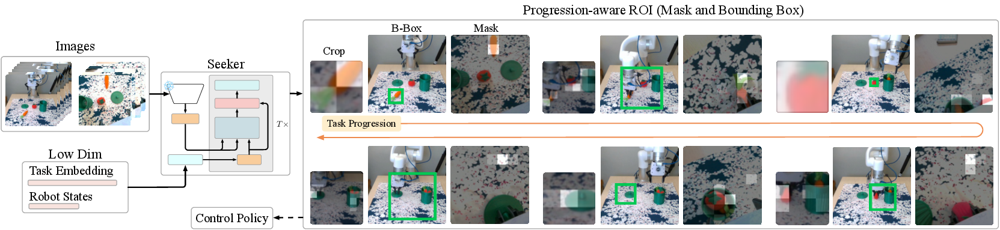
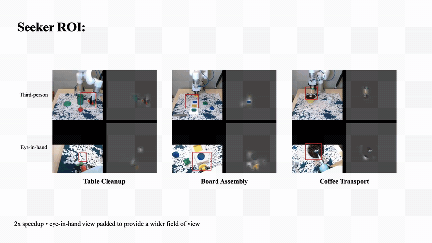

# Seeker

### Attention from Action, for Action: Emergent Visual Bottlenecks for Policy Learning

**Zheyu Zhuang¹ · Ruiyu Wang¹ · Nick Heppert² · Johannes Fabian Hahn³ · Abhinav Valada² · Florian T. Pokorny¹ · Danica Kragic¹**

¹KTH Royal Institute of Technology &nbsp;&nbsp;²University of Freiburg &nbsp;&nbsp;³Universität Hamburg

[**BibTeX**](#citation)

<p align="center">
  
</p>

Seeker is a visuomotor learning framework for learning task-relevant visual bottlenecks directly from action supervision. It predicts soft attention masks and spatial regions from observations, then conditions policy inputs on those regions for more robust and sample-efficient policy learning.

> Visual bottlenecks that focus policy inputs on regions of interest (ROIs) can improve data-efficient visuomotor learning by separating *where to look* from *how to act*. Many ROI interfaces rely on external spatial labels, such as gaze, object classes, or affordance annotations. Label-free alternatives often derive crops from trajectories by detecting gripper or motion events and centering a fixed crop at the projected end-effector. Such action-derived crops are useful spatial priors that require no additional labels, but they encode fixed choices about event timing, proxy points, and crop scale. When the visual evidence needed for control lies away from the end-effector or changes continuously with task progress, these crops can become misaligned. We propose Seeker, a task- and state-conditioned readout that learns *attention from action*. Starting from frozen DINO features, Seeker iteratively updates a query with gathered visual evidence, producing progression-aware ROIs solely from action supervision. The learned ROI serves as a spatial interface for RGB cropping, mask-guided background augmentation, and point-cloud filtering. In simulation and the real world, Seeker improves data efficiency and robustness over no-crop, augmentation, and action-derived crop baselines. On real robots, Seeker raises average in-domain success from the best baseline's 48.3 to 76.7% and success under lighting/background shifts from 20.0 to 60.0%.

### Seeker's learned ROI, live on real-robot rollouts

<p align="center">
  
</p>

<p align="center"><sub>Real-robot rollouts, 2× speedup. Box/mask overlays are Seeker's learned ROI, produced solely from action supervision — no spatial labels at train time.</sub></p>

## Citation

```bibtex
@article{zhuang2026seeker,
  title   = {Attention from Action, for Action: Emergent Visual Bottlenecks for Policy Learning},
  author  = {Zhuang, Zheyu and Wang, Ruiyu and Heppert, Nick and Hahn, Johannes Fabian and Valada, Abhinav and Pokorny, Florian T. and Kragic, Danica},
  year    = {2026},
  note    = {CoRL 2026}
}
```

## At A Glance

- Learns spatial visual bottlenecks from demonstrations instead of relying on fixed handcrafted crops
- Supports Seeker pretraining, Seeker-conditioned policy training, rerendering, playback, and cache merging from a single CLI
- Ships with pinned `.dep` setup for `robosuite`, `robomimic`, and `mimicgen`
- Includes data utilities for raw HDF5 download, LMDB rerendering, and multitask cache merging

## Quickstart

### 1. Clone

```bash
git clone https://github.com/zheyu-zhuang/seeker.git
cd seeker
```

### 2. Create the environment

```bash
mamba env create -f conda_environment.yaml
conda activate seeker
```

The Conda environment installs the editable Seeker package. Install the pinned MimicGen suite dependencies into a sibling checkout with:

```bash
bash seeker/scripts/setup_suite_deps.sh
```

### 3. Install system dependencies

Choose one of the following:

#### Option A: system packages via `sudo` (preferred)

```bash
sudo apt install -y libosmesa6-dev libgl1-mesa-glx libglfw3 patchelf
```

If this succeeds, stop here and do not run the Conda fallback below.

#### Option B: Conda fallback

Run this only if `sudo` is unavailable:

```bash
mamba install -c conda-forge glew mesalib
mamba install -c menpo glfw3
```

### 4. Set up assets

```bash
seeker setup-assets
```

`setup-assets`:

- downloads and extracts `backgrounds.zip` and `textures.zip`
- downloads `.weights/seeker_mimicgen_v1.0.pth` (the pretrained Seeker
  checkpoint), `.weights/dinov3_vits16plus.pth` (the frozen DINOv3 backbone),
  and `.weights/mimicgen.rvt2_heatmap.ckpt` (the `method=rvt2` baseline
  checkpoint), verifying each against a known sha256 checksum
- builds `.weights/task_emb_cache.npz` unless `--skip-task-cache` is set

See [`seeker/model/WEIGHTS.md`](./seeker/model/WEIGHTS.md) for what the
checkpoints are, how `seeker_mimicgen_v1.0.pth` was trained, and their
licenses.

For private collaborators using a private asset release:

```bash
gh auth login
seeker setup-assets --repo <owner/private-repo> --release-tag <tag>
```

`setup-assets` only downloads assets from GitHub releases. If the assets only exist on a private dev branch and are not attached to a release, collaborators need either:

- a published GitHub release containing `backgrounds.zip`, `textures.zip`, `seeker_mimicgen_v1.0.pth`, `dinov3_vits16plus.pth`, and `mimicgen.rvt2_heatmap.ckpt`
- or the files shared manually into `datasets/backgrounds`, `datasets/textures`, and `.weights/`

## Data Workflow

Default paths are defined in [`seeker/config/paths.yaml`](./seeker/config/paths.yaml):

- `dataset_root: datasets/mimicgen`
- `weights_dir: .weights`
- `textures_dir: datasets/textures`
- `backgrounds_dir: datasets/backgrounds`

Expected raw dataset layout:

```text
datasets/
  mimicgen/
    <task_name>/
      <task_name>.hdf5
```

For each task, Seeker may use:

- the raw dataset at `datasets/mimicgen/<task_name>/<task_name>.hdf5`
- the rerendered cache at `datasets/mimicgen/<task_name>/<task_name>_lmdb/`

### Download public MimicGen data

Public datasets are hosted at:

`https://huggingface.co/datasets/amandlek/mimicgen_datasets/`

Example:

```bash
TASK=square_d2

mkdir -p datasets/mimicgen/${TASK}
wget -O "datasets/mimicgen/${TASK}/${TASK}.hdf5" \
  "https://huggingface.co/datasets/amandlek/mimicgen_datasets/resolve/main/core/${TASK}.hdf5?download=true"
```

### Rerender raw HDF5 to cache

Convert a raw HDF5 dataset into the LMDB cache format used by Seeker:

```bash
seeker rerender-dataset \
  --dataset datasets/mimicgen/square_d2/square_d2.hdf5 \
  --n-demo 100 \
  --num-workers 4
```

By default this writes:

```text
datasets/mimicgen/<task_name>/<task_name>_lmdb
```

To build the texture-variant cache used by `experiment=background_generalization`
and `experiment=dr_only` (`num_bg=25`), swap the table texture periodically and
tag the output directory with a matching suffix:

```bash
seeker rerender-dataset \
  --dataset datasets/mimicgen/square_d2/square_d2.hdf5 \
  --n-demo 100 \
  --table-texture-every 4 \
  --output-suffix _tex25 \
  --num-workers 4
```

`--table-texture-every 4` with `--n-demo 100` cycles through 25 distinct table
textures (`100 / 4`), matching `num_bg=25` and writing to
`<task_name>_lmdb_tex25`.

### Merge caches for multitask pretraining

If you are training Seeker on multiple tasks, merge already-rerendered caches into one multitask cache:

```bash
seeker merge-datasets \
  --datasets-root datasets/mimicgen \
  --tasks square_d2 coffee_preparation_d1 stack_three_d1 \
  --output-task mimicgen_multitask_demo_300 \
  --n-demo-per-task 100
```

This writes:

```text
datasets/mimicgen/<output_task>/<output_task>_lmdb
```

For multitask Seeker pretraining, point `train_visual_focus_seeker` at the merged cache by setting `task_name=<output_task>` and `cache_dir=datasets/mimicgen/<output_task>/<output_task>_lmdb`. In this config, `n_demo` means demos per task for merged caches. The default is `100`.

The intended data flow is:

```text
download raw .hdf5 -> rerender-dataset -> merge-datasets (multitask only) -> train
```

## CLI Commands

Main entrypoints:

- `seeker train`
- `seeker rerender-dataset`
- `seeker playback-dataset`
- `seeker merge-datasets`
- `seeker setup-assets`

Run `seeker --help` or `seeker <command> --help` for details.

Hydra overrides still use `key=value`, for example `task_name=square_d2`.

## Common Workflows

### Seeker pretraining

Low-level single-run entrypoint:

```bash
seeker train --config-name=train_visual_focus_seeker \
  task_name=mimicgen_multitask_demo_300 \
  cache_dir=datasets/mimicgen/mimicgen_multitask_demo_300/mimicgen_multitask_demo_300_lmdb \
  name=seeker_pretrain_baseline \
  seed=0
```

Optional overrides:

- `n_demo=<num_demos_per_task>` defaults to `100`
- `task_name=<dataset_name>` such as `square_d2` or `mimicgen_multitask_demo_300`

Config: [`seeker/config/train_visual_focus_seeker.yaml`](./seeker/config/train_visual_focus_seeker.yaml)

### Seeker-conditioned policy training

```bash
seeker train --config-name=train_focus_policy \
  task_name=coffee_preparation_d1 \
  n_demo=100 \
  n_envs=25 \
  name=policy_coffee_baseline \
  seed=0
```

Config: [`seeker/config/train_focus_policy.yaml`](./seeker/config/train_focus_policy.yaml)

Common overrides:

- `action_rep=absolute|delta`
- `disable_eih=true|false`
- `name=<run_name>`
- `exp_name=<experiment_name>`

### Background-generalization policy training

Use `experiment=background_generalization` for table-texture-replaced caches and
select the policy augmentation through `method=seeker|rvt2|mirroraug|oracle`.

```bash
seeker train --config-name=train_focus_policy \
  task_name=stack_three_d1 \
  experiment=background_generalization \
  method=seeker \
  num_bg=25 \
  name=seeker_rand_bg
```

Use `num_bg=1` for the single-background cache. `num_bg=0` resolves to the base
cache while keeping background-generalization experiment logging and rollout
texture shuffling.

Use `experiment=dr_only` for the domain-randomization-only baseline used in
the main results comparison. It still reads the 25-texture background-swapped
cache (`num_bg=25`); the policy augmentation applied on top is whatever
`method` you select, same as `experiment=background_generalization`.

## Action Representations

Seeker uses `action_rep`, not `action_mode`.

- `absolute`: predict world-frame absolute end-effector targets
- `delta`: predict chunked end-effector-frame deltas that are converted back to absolute targets during rollout

Example:

```bash
seeker train --config-name=train_focus_policy \
  task_name=coffee_preparation_d1 \
  action_rep=delta
```

## Playback

```bash
seeker playback-dataset \
  --dataset-path datasets/mimicgen/square_d2/square_d2_lmdb \
  --use-obs
```

## Repository Layout

- [`seeker/`](./seeker): core package, CLI, models, policies, configs, and utilities
- [`.dep/`](./.dep): pinned dependency lock and patches for shareable suite setup
- [`conda_environment.yaml`](./conda_environment.yaml): reproducible environment definition
- [`setup.py`](./setup.py): package metadata and console entry point
- [`LICENSE`](./LICENSE): MIT license for Seeker's original code

## Acknowledgements

This repository is substantially based on and heavily modified from:

- Diffusion Policy: https://github.com/real-stanford/diffusion_policy
  Code adapted into [`seeker/policy/diffusion_policy.py`](./seeker/policy/diffusion_policy.py)
  and [`seeker/model/diffusion/`](./seeker/model/diffusion/).

Additional components are adapted from:

- DINOv3: https://github.com/facebookresearch/dinov3
  Used in [`seeker/model/dinov3_core/`](./seeker/model/dinov3_core/); code and the
  `dinov3_vits16plus.pth` checkpoint distributed via `seeker setup-assets` are
  governed by the DINOv3 License, reproduced in
  [`seeker/model/dinov3_core/LICENSE.md`](./seeker/model/dinov3_core/LICENSE.md).

The patched `robosuite`/`robomimic`/`mimicgen` suite (pinned via
[`.dep/`](./.dep)) is a separate vendored dependency, unrelated to DINOv3 or
Diffusion Policy above.

Please refer to the upstream repositories for original implementation details and license terms.

## License

MIT for Seeker's original code, including the trained
`seeker_mimicgen_v1.0.pth` checkpoint. See [`LICENSE`](./LICENSE). Vendored
third-party components (DINOv3, Diffusion Policy, and the patched
robosuite/robomimic/mimicgen suite under `.dep/`) retain their own upstream
licenses as noted above and in their respective directories. See
[`seeker/model/WEIGHTS.md`](./seeker/model/WEIGHTS.md) for checkpoint
provenance, compatibility requirements, and checksums.
